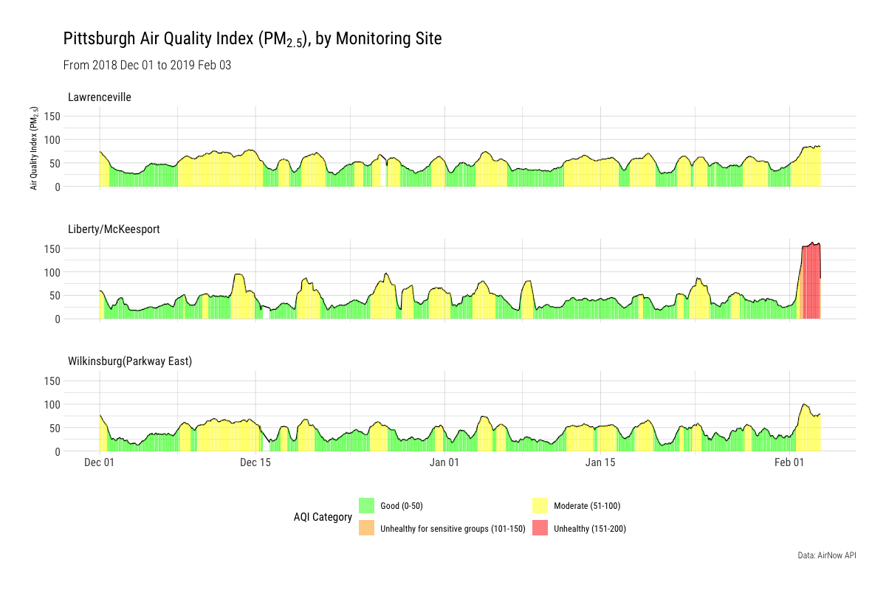
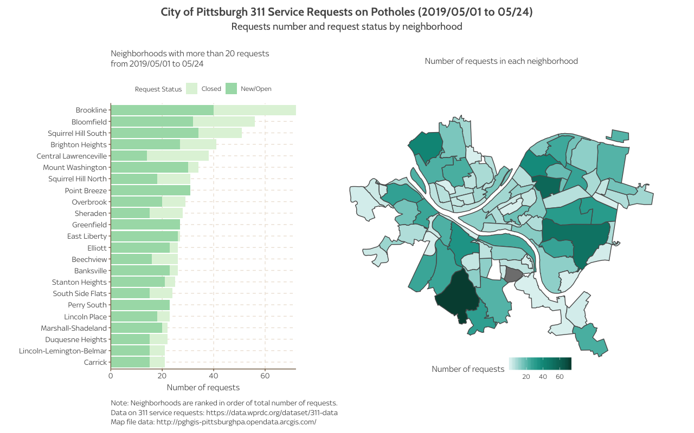
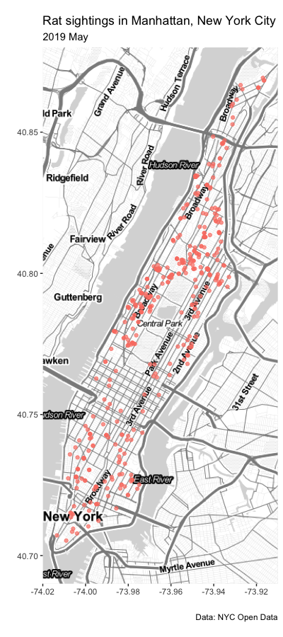
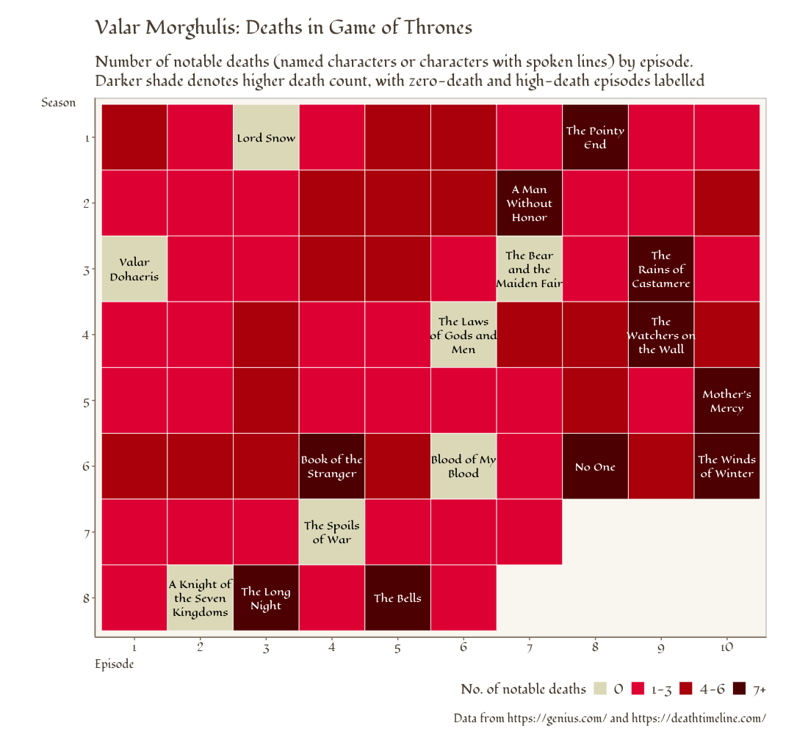
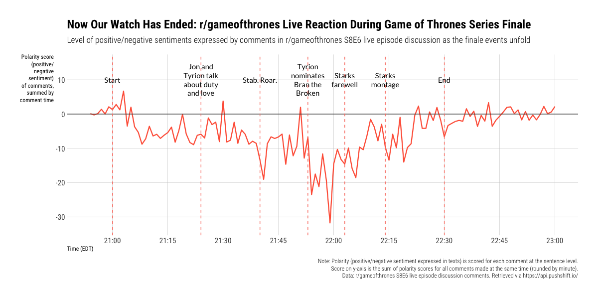

<style>
h1, h2, h3, h4 {
  font-family: titillium web, sans-serif;
}

body, p {
  font-family: roboto, sans-serif;
  <!-- font-size: 12pt; -->
}

pre, code {
  font-family: menlo, monospace;
  font-size: 10pt;
}
</style>

```{r klippy, echo=FALSE, include=TRUE}
klippy::klippy(color = 'darkred')
```

#  {.tabset .tabset-pills}

## Pittsburgh Things

### Pittsburgh Air Quality



* Data Source: [Air Now](http://www.airnowapi.org){target="_blank"}. 
* Date for data retrieved: 2018-12-01 to 2019-02-03

```{r eval=FALSE, include=TRUE}
library(tidyverse)
library(httr)
library(lubridate)
library(hrbrthemes)

#### Data ####
api_key <- "get API key from http://www.airnowapi.org"

# Requesting for: 2018-12-01 to 2019-02-03, PM2.5 AQI
url_base <- "http://www.airnowapi.org/aq/data/?startDate=2018-12-01T00&endDate=2019-02-03T18&parameters=PM25&BBOX=-80.154378,40.263542,-79.745138,40.555282&dataType=A&format=application/json&verbose=1&API_KEY="
AQI_raw_json <- GET(paste0(url_base, api_key))
AQI_pitt_json <- content(AQI_raw_json)

# Convert to flat dataframe
AQI_dec_feb <- lapply(AQI_pitt_json, flatten_df) %>%
  bind_rows() %>%
  mutate(Category = factor(Category),
         UTC = ymd_hm(UTC),
         year = year(UTC),
         month = month(UTC),
         day = day(UTC),
         hour = hour(UTC),
         site = fct_recode(SiteName, 
                           "Liberty/McKeesport" = "Liberty (SAHS)",
                           "Wilkinsburg(Parkway East)" = "Parkway East (Near Road)"))

#### Plot ####
aqi_color <- c("1" = "green",
               "2" = "yellow",
               "3" = "orange",
               "4" = "red")

aqi_code <- c("Good (0-50)", 
              "Moderate (51-100)", 
              "Unhealthy for sensitive groups (101-150)", 
              "Unhealthy (151-200)", 
              "Very unhealthy (201-300)")

plot_by_site <- AQI_dec_feb %>%
  ggplot() +
  geom_line(aes(x = UTC, y = AQI)) +
  geom_col(aes(x = UTC, y = AQI, fill = Category), alpha = 0.5)  +
  facet_wrap(~ site, ncol = 1)

plot_by_site +
  scale_fill_manual(values = aqi_color,
                    name = "AQI Category",
                    labels = aqi_code) +
  labs(title = expression("Pittsburgh Air Quality Index (PM"[2.5]*"), by Monitoring Site"),
       subtitle = "From 2018 Dec 01 to 2019 Feb 03",
       caption = "Data: AirNow API",
       x = "", y = expression("Air Quality Index (PM"[2.5]*")")) +
  guides(fill = guide_legend(nrow = 2, byrow = TRUE)) +
  hrbrthemes::theme_ipsum_rc() +
  theme(legend.position = "bottom")
```


---


### Potholes



Data source:

* 311 service requests: [Western Pennsylvania Regional Data Center](https://data.wprdc.org/dataset/311-data){target="_blank"}
* Map shape file: [PGH Open Data](http://pghgis-pittsburghpa.opendata.arcgis.com/datasets/dbd133a206cc4a3aa915cb28baa60fd4_0){target="_blank"}

```{r eval=FALSE}
library(tidyverse)
library(patchwork)
library(sf)

# Theme
ggthemr::ggthemr("fresh")

#### Data ####
pit_pothole <- read_csv("data/pittsburgh_311.csv")

pit_pothole_201905 <- pit_pothole %>%
  mutate(request_date = as_date(CREATED_ON)) %>%
  filter(REQUEST_TYPE == "Potholes", request_date >= "2019-05-01") %>%
  select(REQUEST_ID, request_date, STATUS, NEIGHBORHOOD, TRACT, X, Y)

# Status: 0 = New, 1 = Closed, 3 = Open
pit_pothole_201905 <- pit_pothole_201905 %>%
  filter(!is.na(NEIGHBORHOOD)) %>%
  group_by(NEIGHBORHOOD) %>%
  mutate(Neighborhood_count = n()) %>%
  ungroup() %>%
  mutate(request_status = if_else(STATUS == 1, "Closed", "New/Open"))

#### Bar plot ####
data_bar <- pit_pothole_201905 %>%
  filter(Neighborhood_count >= 20) %>%
  group_by(NEIGHBORHOOD, Neighborhood_count, request_status) %>% 
  summarise(request_status_n = n()) 

pothole_bar <- data_bar %>%
  ggplot(aes(x = request_status_n, 
             y = reorder(NEIGHBORHOOD, Neighborhood_count), 
             group = request_status,
             fill = request_status)) +
  ggstance::geom_colh() +
  scale_x_continuous(expand = c(0, 0)) +
  scale_fill_brewer(name = "Request Status", 
                    palette = "GnBu") +
  labs(x = "Number of requests", 
       y = "",
       #title = "311 Service Requests on Potholes",
       subtitle = "Neighborhoods with more than 20 requests \nfrom 2019/05/01 to 05/24\n",
       caption = "\nNote: Neighborhoods are ranked in order of total number of requests.
                 \nData on 311 service requests: https://data.wprdc.org/dataset/311-data
                 \nMap file data: http://pghgis-pittsburghpa.opendata.arcgis.com/") +
  theme(legend.position = "top",
        legend.title = element_text(size = 10),
        text = element_text(family = "Sky Text"),
        plot.subtitle = element_text(lineheight = 1, size = 12),
        plot.caption = element_text(lineheight = 0.5, hjust = 0),
        axis.text = element_text(size = 11))


#### Choropleth map ####

# Shape file
pit_neighborhood_shape <- st_read("data/Neighborhoods/Neighborhoods_.shp")

data_map <- pit_pothole_201905 %>%
  filter(!is.na(NEIGHBORHOOD)) %>%
  group_by(NEIGHBORHOOD) %>%
  summarise(Neighborhood_count = n()) %>%
  ungroup()

data_map_joined <- pit_neighborhood_shape %>%
  left_join(data_map, by = c("hood" = "NEIGHBORHOOD"))

pothole_map <- ggplot(data_map_joined) +
  geom_sf(aes(fill = Neighborhood_count), size = 0.5) +
  coord_sf(datum = NA) +
  ggsci::scale_fill_material("teal", name = "Number of requests") +
  labs(x = "", y = "",
       subtitle = "Number of requests in each neighborhood\n") +
  theme(legend.position = c(0.5, 0),
        legend.direction = "horizontal",
        plot.subtitle = element_text(lineheight = 0.5, size = 12, hjust = 0.5),
        text = element_text(family = "Sky Text"))

# Combine two graphs together
pothole_bar + pothole_map + 
  plot_layout(widths = c(1, 2)) +
  plot_annotation(title = "City of Pittsburgh 311 Service Requests on Potholes (2019/05/01 to 05/24)",
                  subtitle = "Request number and request status by neighborhood\n",
                  theme = theme(plot.margin = margin(10, 10, 10, 10, unit = "pt"),
                                plot.title = element_text(family = "Cabin", 
                                                          hjust = 0.5,
                                                          size = 16),
                                plot.subtitle = element_text(family = "Cabin", 
                                                             hjust = 0.5,
                                                             size = 14)))
```


## Maps

### Rat sightings in NYC



* Data acquired from: [NYC Open Data](https://data.cityofnewyork.us/Social-Services/Rat-Sightings/3q43-55fe){target="_blank"}. 
* Date for data retrieved: 2019-05-01 to 2019-05-31

```{r eval=FALSE}
library(lubridate)
library(tidyverse)
library(ggmap)

##### Data ######
nyc_rat <- read_csv("data/NYC_Rat_Sightings.csv")

manhattan_rat <- nyc_rat %>%
  mutate(date_created = mdy_hms(`Created Date`, tz = "America/New_York"),
         date_created = as_date(date_created),
         date_closed = mdy_hms(`Closed Date`, tz = "America/New_York"),
         date_closed = as_date(date_closed)) %>%
  select(`Unique Key`, date_created, date_closed, `Incident Zip`, `Incident Address`, 
         City, Borough, Latitude, Longitude, Location, `Created Date`, `Closed Date`) %>%
  filter(Borough == "MANHATTAN")


##### Draw map ######

# Get static map
manhattan_bbox <- c(left=-74.02, bottom=40.69, right=-73.91, top=40.88)

manhattan_map <- get_stamenmap(manhattan_bbox, 
                               zoom = 12,
                               maptype = "toner-lite") %>% ggmap()

# Add rat sighting locations
manhattan_map +
  geom_point(data = manhattan_rat, 
             aes(x = Longitude, y = Latitude), 
             color = "salmon", alpha = 0.7) +
  labs(title = "Rat sightings in Manhattan, New York City",
       subtitle = "2019 May",
       caption = "Data: NYC Open Data",
       x = "", y = "")
```


---


### Distribution of rental households in Singapore

```{r include=FALSE}
library(tidyverse)
library(sf)
library(leaflet)
library(htmltools)

##### Data #####

# Shape file
# Path to shp shape file for Singapore map with demarcated planning areas
shp_path <- "data/planning-area-census2010-shp/Planning_Area_Census2010.shp"

# Import shp as sf object
pln_sf <- st_read(shp_path)

# Transform shape polygons to coordinates
pln_coord <- st_transform(pln_sf, crs = "+proj=longlat +datum=WGS84")

# Tenancy data
tenancy_2015 <- read_csv("data/households_tenancy_2015.csv")

tenancy_2015 <- tenancy_2015 %>%
  mutate(PLN_AREA_N = toupper(planning_area),
         total = (owner + tenant + others),
         owner = na_if(owner, 0),
         tenant = na_if(tenant, 0),
         others = na_if(others, 0),
         total = na_if(total, 0),
         others = ifelse(!is.na(total) & is.na(others), 0L, others),
         tenant_pct = (tenant / total),
         tenant_pct_f = ifelse(is.na(total), "N.A.", scales::percent(tenant_pct)),
         owner_pct = (owner / total),
         owner_pct_f = ifelse(is.na(total), "N.A.", scales::percent(owner_pct)),
         other_pct = (others / total),
         other_pct_f = ifelse(is.na(total), "N.A.", scales::percent(other_pct)))

# Join with map coordinates data
tenancy_map_joined <- pln_coord %>%
  full_join(tenancy_2015, by = c("PLN_AREA_N"))


##### leaflet #####

# Create fill palettes: tenancy percent
tenant_pct_pal <- colorNumeric(palette = "viridis",
                               domain = tenancy_map_joined$tenant_pct,
                               na.color = "gray")

# Format labels 
map_label <- sprintf(
  "<strong>%s</strong><br/> 
  Owners: %s (%s)<br/>
  Tenants: %s (%s)<br/>
  Others: %s (%s)<br/>
  Total: %s residential households",
  tenancy_map_joined$planning_area,
  scales::comma(tenancy_map_joined$owner),
  tenancy_map_joined$owner_pct_f,
  scales::comma(tenancy_map_joined$tenant),
  tenancy_map_joined$tenant_pct_f,
  scales::comma(tenancy_map_joined$others),
  tenancy_map_joined$other_pct_f,
  scales::comma(tenancy_map_joined$total)
) %>% lapply(HTML)
```

```{r echo=FALSE}
# Build interactive map
tenancy_map_joined %>%
  leaflet(options = leafletOptions(minZoom = 9, maxZoom = 14)) %>%
  setView(lng = 103.8, lat = 1.36, zoom = 11) %>%
  addProviderTiles("CartoDB") %>%
  addPolygons(weight = 1,
              color = ~tenant_pct_pal(tenant_pct),
              fillOpacity = 0.7,
              label = map_label,
              highlight = highlightOptions(weight = 3,
                                           color = "red",
                                           bringToFront = TRUE)) %>%
  addLegend("topright",
            pal = tenant_pct_pal,
            data = tenancy_map_joined,
            values = ~ tenant_pct,
            title = "% Households Renting",
            labFormat = labelFormat(suffix = "%", 
                                    transform = function(x) 100 * x ))
```

Data source: [Data.gov.sg](https://data.gov.sg/){target="_blank"}

* [Tenancy data](https://data.gov.sg/dataset/resident-households-by-planning-area-and-tenancy-2015){target="_blank"}
* [Map shape file](https://data.gov.sg/dataset/planning-area-census2010){target="_blank"}

```{r eval=FALSE, include=TRUE}
library(tidyverse)
library(sf)
library(leaflet)
library(htmltools)

##### Data #####

# Shape file
# Path to shp shape file for Singapore map with demarcated planning areas
shp_path <- "data/planning-area-census2010-shp/Planning_Area_Census2010.shp"

# Import shp as sf object
pln_sf <- st_read(shp_path)

# Transform shape polygons to coordinates
pln_coord <- st_transform(pln_sf, crs = "+proj=longlat +datum=WGS84")

# Tenancy data
tenancy_2015 <- read_csv("data/households_tenancy_2015.csv")

tenancy_2015 <- tenancy_2015 %>%
  mutate(PLN_AREA_N = toupper(planning_area),
         total = (owner + tenant + others),
         owner = na_if(owner, 0),
         tenant = na_if(tenant, 0),
         others = na_if(others, 0),
         total = na_if(total, 0),
         others = ifelse(!is.na(total) & is.na(others), 0L, others),
         tenant_pct = (tenant / total),
         tenant_pct_f = ifelse(is.na(total), "N.A.", scales::percent(tenant_pct)),
         owner_pct = (owner / total),
         owner_pct_f = ifelse(is.na(total), "N.A.", scales::percent(owner_pct)),
         other_pct = (others / total),
         other_pct_f = ifelse(is.na(total), "N.A.", scales::percent(other_pct)))

# Join with map coordinates data
tenancy_map_joined <- pln_coord %>%
  full_join(tenancy_2015, by = c("PLN_AREA_N"))


##### leaflet #####

# Create fill palettes: tenancy percent
tenant_pct_pal <- colorNumeric(palette = "viridis",
                               domain = tenancy_map_joined$tenant_pct,
                               na.color = "gray")

# Format labels 
map_label <- sprintf(
  "<strong>%s</strong><br/> 
  Owners: %s (%s)<br/>
  Tenants: %s (%s)<br/>
  Others: %s (%s)<br/>
  Total: %s residential households",
  tenancy_map_joined$planning_area,
  scales::comma(tenancy_map_joined$owner),
  tenancy_map_joined$owner_pct_f,
  scales::comma(tenancy_map_joined$tenant),
  tenancy_map_joined$tenant_pct_f,
  scales::comma(tenancy_map_joined$others),
  tenancy_map_joined$other_pct_f,
  scales::comma(tenancy_map_joined$total)
) %>% lapply(HTML)

# Build interactive map
tenancy_map_joined %>%
  leaflet(options = leafletOptions(minZoom = 9, maxZoom = 14)) %>%
  setView(lng = 103.8, lat = 1.36, zoom = 11) %>%
  addProviderTiles("CartoDB") %>%
  addPolygons(weight = 1,
              color = ~tenant_pct_pal(tenant_pct),
              fillOpacity = 0.7,
              label = map_label,
              highlight = highlightOptions(weight = 3,
                                           color = "red",
                                           bringToFront = TRUE)) %>%
  addLegend("topright",
            pal = tenant_pct_pal,
            data = tenancy_map_joined,
            values = ~ tenant_pct,
            title = "% Households Renting",
            labFormat = labelFormat(suffix = "%", 
                                    transform = function(x) 100 * x ))
```


## Game of Thrones (spoilers!)

### Number of deaths in GOT episodes



[Data](data/GOT_death.csv) used for the plot, based on [Fandom](https://listofdeaths.fandom.com/wiki/Game_of_Thrones){target="_blank"}.

```{r eval=FALSE, include=TRUE}
library(tidyverse)

death_episode <- read_csv("data/GOT_death.csv")

plot_death_episode <- death_episode %>%
  mutate(named_death_cat = case_when(named_death == 0 ~ "0",
                                     named_death > 0 & named_death <= 3 ~ "1-3",
                                     named_death > 3 & named_death <= 6 ~ "4-6",
                                     named_death > 6 ~ "7+")) %>%
  ggplot(aes(x = episodeNum, y = seasonNum)) +
  geom_tile(aes(fill = named_death_cat), color = "white", size = 0.3) 


plot_death_episode  +
  geom_text(data = subset(death_episode, named_death >= 7),
            aes(label = str_wrap(episodeTitle, width = 11), group = "named_death"),
            color = "white", size = 3.5, fontface = "bold", family = "Eagle Lake") +
  geom_text(data = subset(death_episode, named_death == 0),
            aes(label = str_wrap(episodeTitle, width = 11), group = "named_death"), 
            color = "black", size = 3.5, fontface = "bold", family = "Eagle Lake") +
  coord_equal() +
  gameofthrones::scale_fill_got_d(option = "targaryen2", direction = 1, begin = 0, end = 1) +
  guides(fill = guide_legend(title = "No. of notable deaths", 
                             reverse = FALSE,
                             barheight = 1,
                             keywidth = 1, 
                             keyheight = 1)) +
  labs(x = "Episode", y = "Season",
       title = "Valar Morghulis: Deaths in Game of Thrones",
       subtitle = "Number of notable deaths (named characters or characters with spoken lines) by episode. 
                  \nDarker shade denotes higher death count, with zero-death and high-death episodes labelled",
       caption = "\nData from Fandom (https://listofdeaths.fandom.com/wiki/Game_of_Thrones)") +
  theme(legend.position = "bottom",
        text = element_text(family = "Fondamento"),
        legend.title = element_text(size = 14),
        legend.text = element_text(size = 14),
        legend.justification = c(1,0),
        plot.margin = margin(10, 10, 10, 10, "pt"),
        plot.title = element_text(size = 20, 
                                  margin = margin(10, 10, 10, 10, "pt")),
        plot.subtitle = element_text(lineheight = 0.5, size = 16, 
                                     margin = margin(10, 10, 10, 10, "pt")),
        plot.caption = element_text(size = 12),
        panel.border = element_rect(fill = NA, color = "gray80", size = 1),
        panel.grid.major = element_blank(),
        panel.grid.minor = element_blank(),
        axis.title.x = element_text(size = 12, hjust = 0),
        axis.title.y = element_text(size = 12, angle = 0, vjust = 1),
        axis.text.x = element_text(size = 12),
        axis.text.y = element_text(size = 12))

```


---


### Reddit sentiment analysis during GOT finale



[Data](data/S806_live_comment.rds) used for the plot, retrieved via [Pushshift Reddit API](https://github.com/pushshift/api){target="_blank"}

```{r eval=FALSE, include=TRUE}
library(tidyverse)
library(lubridate)
library(magrittr)
library(sentimentr)

theme_set(hrbrthemes::theme_ipsum_rc() +
            theme(legend.position = "bottom"))

S806_live <- readRDS("data/S806_live_comment.rds")

S806_live <- S806_live %>%
  filter(author != "AutoModerator") %>%
  mutate(episode = "806",
         discussion = "live",
         comment_time = as_datetime(comment_time, tz = "America/New_York"),
         comment_time_2 = floor_date(comment_time, "minute"))

S806_live_sentiment <- S806_live %>%
  mutate(comment_split = get_sentences(comment)) %$%
  sentiment_by(comment_split, list(author, comment_time_2))

S806_live_sentiment_sum <- S806_live_sentiment %>% 
  group_by(comment_time_2) %>%
  summarise(sentiment_count = sum(ave_sentiment))


S806_moment <- tibble(time = as.POSIXct(c("2019-05-19 21:00:00",
                                          "2019-05-19 21:24:00",
                                          "2019-05-19 21:40:00",
                                          "2019-05-19 21:53:00",
                                          "2019-05-19 22:03:00",
                                          "2019-05-19 22:14:00",
                                          "2019-05-19 22:30:00")),
                      label = c("Start",
                                "Jon and Tyrion talk about duty and love",
                                "Stab. Roar.",
                                "Tyrion nominates Bran the Broken",
                                "Starks farewell",
                                "Starks montage",
                                "End"))

labe_yaxis = "Polarity score (positive/negative sentiment) of comments, summed by comment time"

S806_live_sentiment_sum %>%  
  filter(comment_time_2 >= "2019-05-19 20:50:00") %>% 
  filter(comment_time_2 <= "2019-05-19 23:00:00") %>% 
  ggplot(aes(x = comment_time_2, y = sentiment_count)) +
  geom_line(color = "tomato", size = 0.8) +
  geom_hline(yintercept = 0, 
             linetype = "solid", color = "grey30") +
  geom_vline(xintercept = S806_moment$time,
             linetype = "dashed", color = "salmon") +
  annotate("text",
           x = S806_moment$time,
           y = 10,
           #hjust = -0.5,
           lineheight = 1,
           label = str_wrap(S806_moment$label, width = 12),
           family = "Lato") +
  scale_x_datetime(breaks = scales::pretty_breaks(10)) +
  scale_y_continuous(limits = c(-33, 15)) +
  labs(x = "Time (EDT)",
       y = str_wrap(labe_yaxis, width = 14),
       title = "Now Our Watch Has Ended: r/gameofthrones Live Reaction During Game of Thrones Series Finale",
       subtitle = "Level of positive/negative sentiments expressed by comments in r/gameofthrones S8E6 live episode discussion as the finale events unfold",
       caption = "Note: Polarity (positive/negative sentiment expressed in texts) is scored for each comment at the sentence level.
                  \nScore on y-axis is the sum of polarity scores for all comments made at the same time (rounded by minute).
                  \nData: r/gameofthrones S8E6 live episode discussion comments. Retrieved via https://api.pushshift.io/") +
  theme(panel.grid.minor = element_blank(),
        axis.title.x = element_text(hjust = 0),
        axis.title.y = element_text(angle = 0, lineheight = 1),
        plot.title = element_text(lineheight = 0.5),
        plot.caption = element_text(lineheight = 0.5)) 
```

